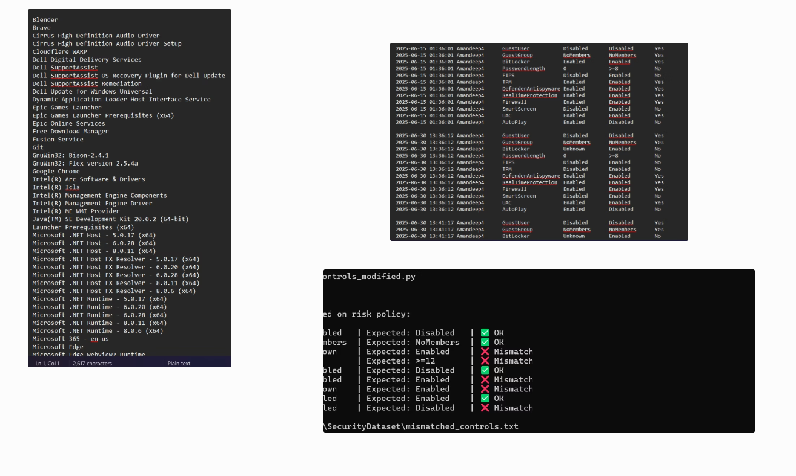
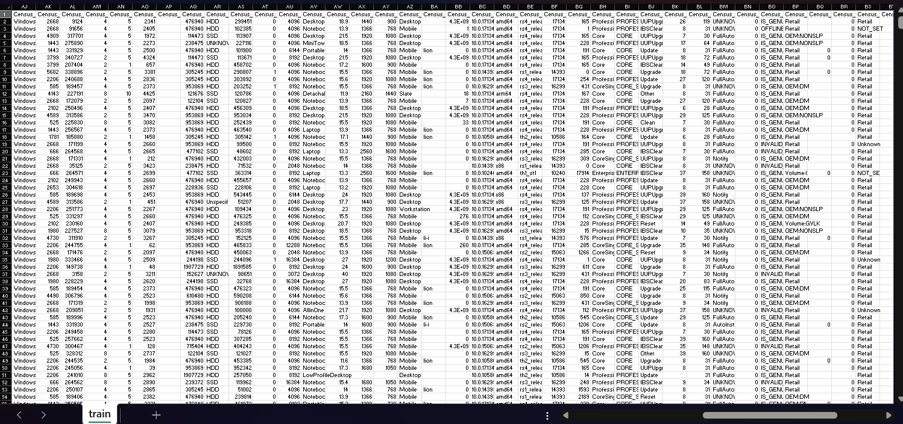
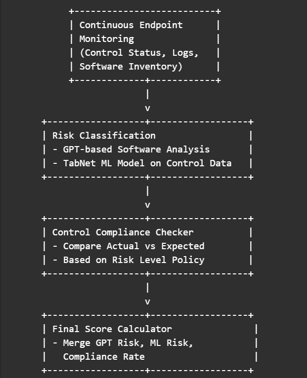
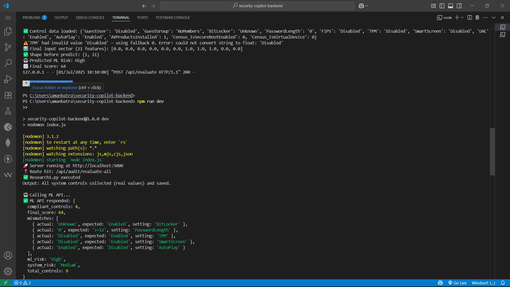

# 🛡️ IEPIS – Intelligent Endpoint Protection & Inspection System

This project integrates **software risk classification (GPT-based)**, **system control auditing**, and a **TabNet ML model** to assess endpoint risk.  
It provides a combined **risk score (0–100)** and highlights **policy mismatches** for compliance reporting.

---

## 📊 Visual Workflow & Results

### 1. Security Audit & Control Data
 
*System audit collects registry-based control values (BitLocker, TPM, SmartScreen, etc.) and checks them against expected policies. Mismatches are logged clearly for compliance review.*

---

### 2. Model Training Data
 
*TabNet was trained on a synthetic dataset with thousands of system control states and Census hardware features. Each row represents one endpoint configuration with labels for risk classification.*

---

### 3. End-to-End Workflow

*The pipeline integrates three layers: GPT-based software risk classification, TabNet ML predictions on control vectors, and a policy compliance checker. All results are merged into a final 0–100 score.*

---

### 4. API & Final Score Output

*Flask API running locally: returns system risk, ML risk, mismatched controls, compliance rate, and final score in JSON response format.*

---

## ⚙️ How It Works
1. Collect installed software list via PowerShell → refine with GPT.  
2. Extract security control values from registry.  
3. Run ML model (TabNet) on system + control vectors.  
4. Combine results → return **final endpoint risk score**.  

---

## 🚀 Running Locally
```bash
# clone repository
git clone https://github.com/callmegus4444/IEPIS.git
cd IEPIS

# install dependencies
pip install -r requirements.txt

# run API
python app.py
